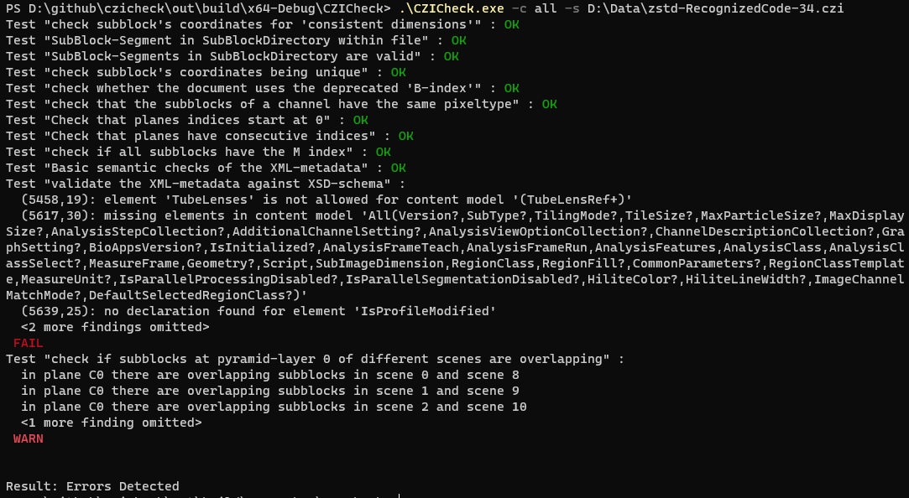

### usage


# synopsis

Running CZICheck with the `--help` option will print a brief summary of the available options and their usage:

```
CZICheck version 0.1.0, using libCZI version 0.49.0

Usage: CZICheck [OPTIONS]

Options:
  -h,--help                   Print this help message and exit
  -s,--source FILENAME        Specify the CZI-file to be checked.
  -c,--checks CHECKS-TO-BE-RUN
                              Specifies a comma-separated list of short-names of checkers
                              to run. In addition to the short-names, the following
                              "set-names" are possible : 'default' and 'all'. 'default'
                              means "all checkers which are not flagged as opt-in", and
                              'all' means "all available checkers". A minus ('-')
                              prepended to the checker-short-name (or set-name) means that
                              this checker or set is to be removed from the list of
                              checkers to run.
                              A plus('+') means that it is to be added, and this is also
                              the default if no plus or minus is prepended.
                              Examples:
                              "default, -benabled" : run all checkers in the "default set"
                                                     without the checker 'benabled'
                              "+benabled, +planesstartindex" : run only the checkers
                                                               'benabled' and
                                                               'planesstartindex'
                              Default is 'default'.

  -m,--maxfindings INTEGER    Specifies how many findings are to be reported and printed
                              (for every check).
                              A negative number means 'no limit'. Default is 3.

  -d,--printdetails BOOLEAN   Specifies whether to print details (if available) with a
                              finding. The argument may be one of 'true', 'false', 'yes'
                              or 'no'.


The exit code of CZICheck is
 0  - all checks completed without an error or a warning
 1  - the checks found some warnings, but no errors
 2  - the checks gave one or more errors
 5  - the CZI-file could not be read or opened
 10 - the command line arguments are invalid

Available checkers:
"subblkdimconsistent" -> check subblock's coordinates for 'consistent dimensions'
"subblksegmentsinfile" -> SubBlock-Segment in SubBlockDirectory within file
"subblksegmentsvalid" -> SubBlock-Segments in SubBlockDirectory are valid
"subblkcoordsunique" -> check subblock's coordinates being unique
"benabled" -> check whether the document uses the deprecated 'B-index'
"samepixeltypeperchannel" -> check that the subblocks of a channel have the same pixeltype
"planesstartindex" -> Check that planes indices start at 0
"consecutiveplaneindices" -> Check that planes have consecutive indices
"minallsubblks" -> check if all subblocks have the M index
"basicxmlmetadata" -> Basic semantic checks of the XML-metadata
"xmlmetadataschema" -> validate the XML-metadata against XSD-schema [opt-in]
"overlappingscenes" -> check if subblocks at pyramid-layer 0 of different scenes are overlapping
```

All checkers listed at the bottom are available for use. The ones marked with `[opt-in]` are not run by default, but can be enabled by adding them to the list of checkers to be run (or by using 'all' as argument for the '--checks' argument).

# example

Here is the output of a sample run:



All checkers run one after the other. If a checker finds a problem, it will print a message to the console. Those messages are categorized into three categories: `error`, `warning` and `info`. 
The result of a checker is then one of `OK`, `WARN` or `FAIL`. The result of the complete operation is then the aggregation of all checkers (and the return code of the application is then chosen
according to above table).

